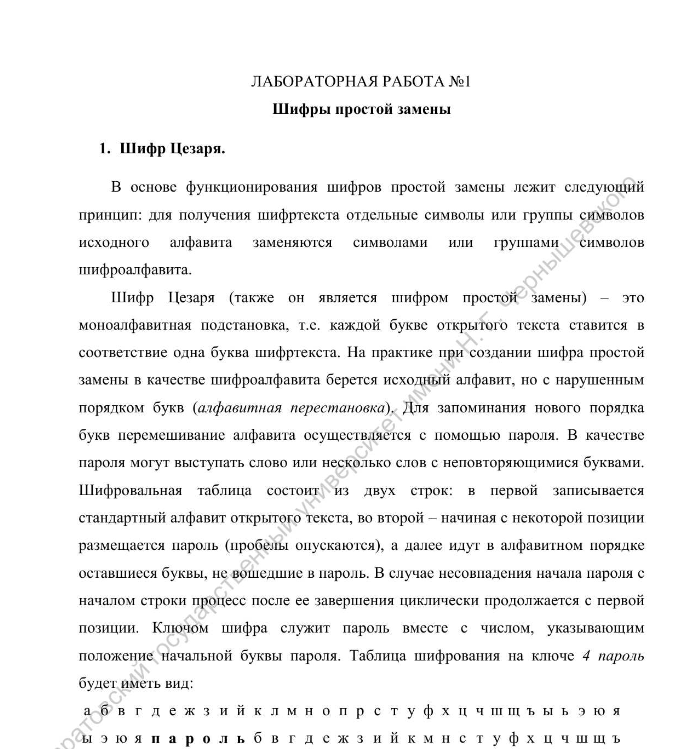
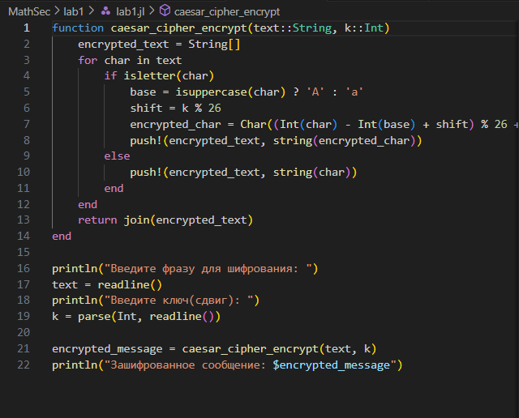
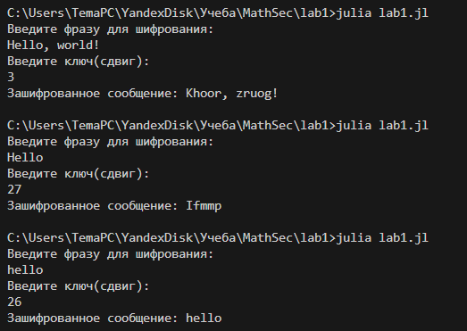
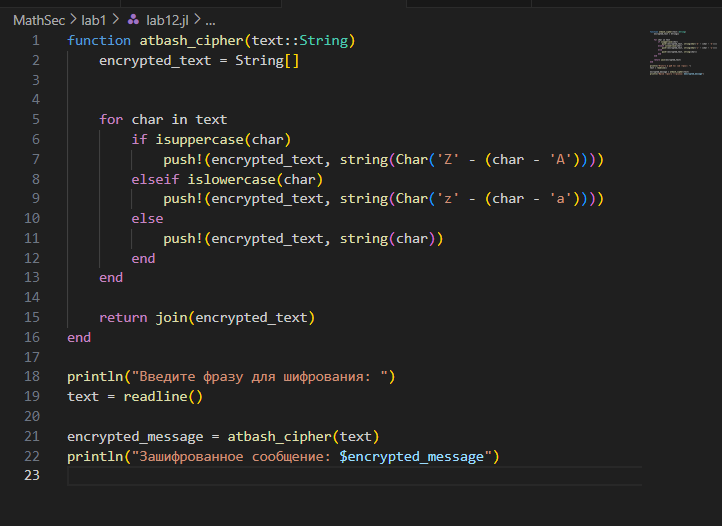
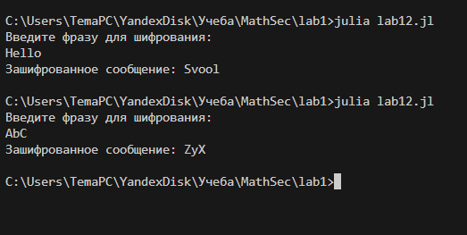

## Цели и задачи

1. Изучить шифры простой замены.

2. Реализовать шифр Цезаря с произвольным ключом k.

3. Реализовать шифр Атбаш.

## Ход работы

Изучим файл лабороторной работы №1.

{#fig:009 width=90%}

## Ход работы

Используя язык программирования Julia приступим к реализации кода для шифра Цезаря с произвольным ключом k.

{#fig:009 width=90%}

## Ход работы

Запустим написанный код и введем с клавиатуры сначала сообщение, которое нужно зашифровать, а затем ключ(сдвиг), на который будем сдвигать символы по алфавиту.

{#fig:009 width=90%}

## Ход работы

Приступим к реализации шифра атбаш на языке Julia.

{#fig:009 width=90%}

## Ход работы

Запустим написанный код и введем с клавиатуры сообщение, которое нужно зашифровать.

{#fig:009 width=90%}

## Результаты

В рамках данной лабораторной работы были получены практические навыки в написании простых методов шифрования на языке Julia.