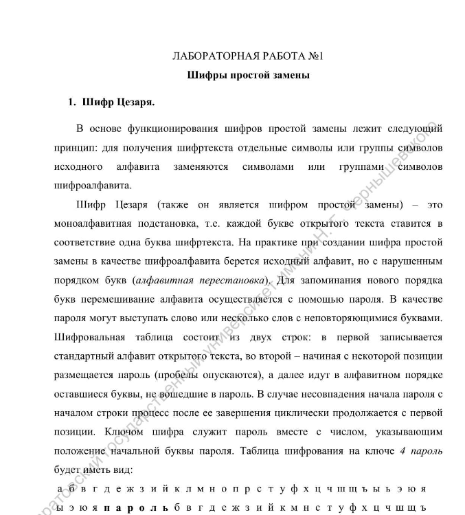
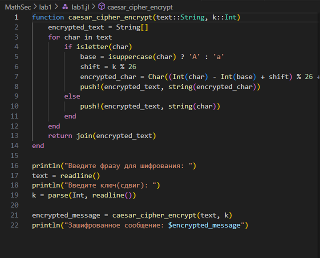
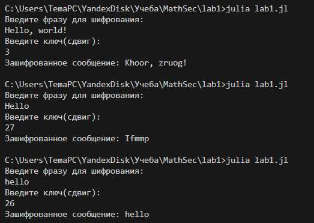
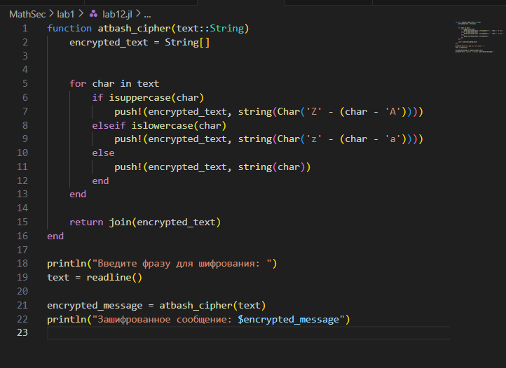
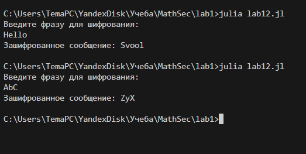

# Цель работы

1. Изучить шифры простой замены.

2. Реализовать шифр Цезаря с произвольным ключом k.

3. Реализовать шифр Атбаш.

---
# Выполнение лабораторной работы

1. Изучим файл лабороторной работы №1.

{#fig:001 width=90%}

2. Используя язык программирования Julia приступим к реализации кода для шифра Цезаря с произвольным ключом k.

{#fig:001 width=90%}

3. Запустим написанный код и введем с клавиатуры сначала сообщение, которое нужно зашифровать, а затем ключ(сдвиг), на который будем сдвигать символы по алфавиту.

{#fig:001 width=90%}

4. Приступим к реализации шифра атбаш на языке Julia.

{#fig:001 width=90%}

5. Запустим написанный код и введем с клавиатуры сообщение, которое нужно зашифровать.

{#fig:001 width=90%}

# Выводы

В рамках данной лабораторной работы были получены практические навыки в написании простых методов шифрования на языке Julia.